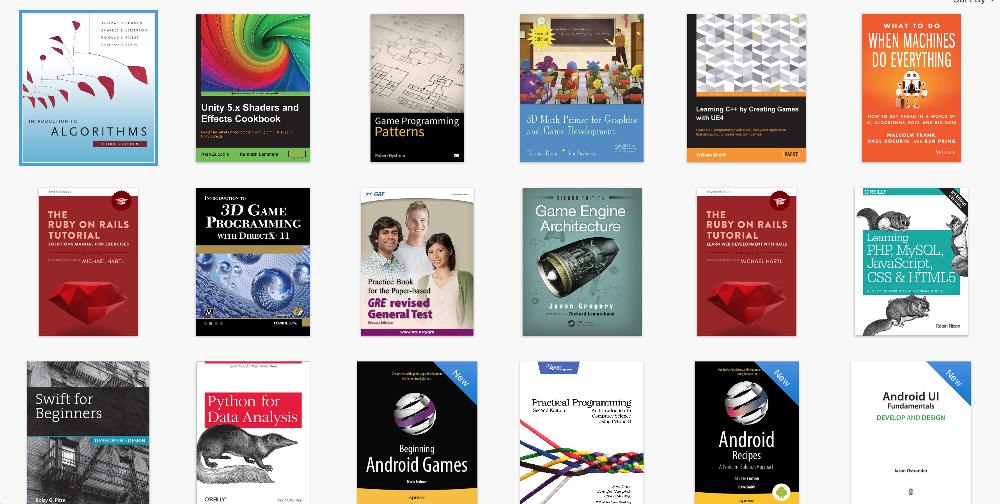
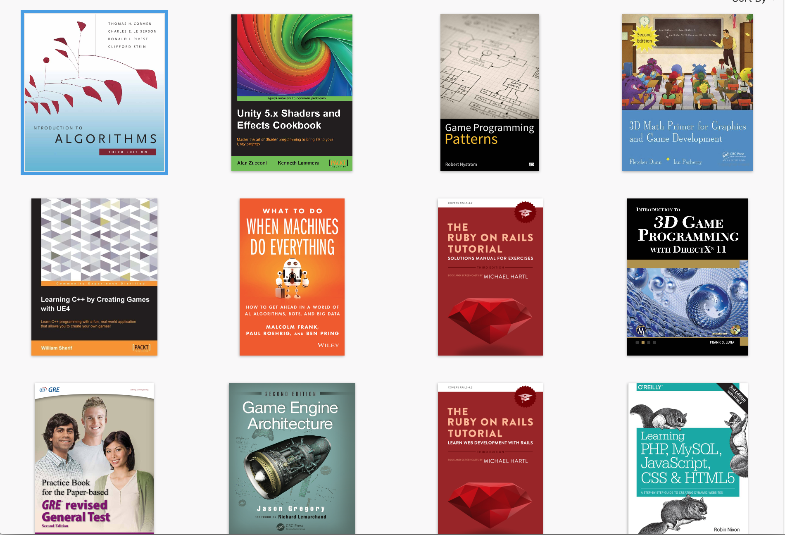

# CSS Deep

## Release 1:

- Create an ibooks clone. When you re-size the page, each row should show less number of books in that particular row. 

## Release 2:

- Create a bootstrap like front-end(only CSS part) library that would handle media queries(small, medium, large) for any of your webpage that you create.

NOTE: Feel free to browse BootStrap source code and get motivation from it

## Release 3:

- Create a webpage with WebButton Showcases for all social media websites mentioned here: facebook, myspace, pinterest, youtube, twitter, instagram, snapchat, linkedIn, VK, Messenger. Just so whenever you click or hover any button it should show other sprite than the default one and should look like the button is animating. 

**Note**: Only use CSS

## Release 4:

- Learn either one of them: SASS/LESS
- Make a website with any agenda & use SASS/LESS 
- Expore a tool called CodeKit. Why do people use CodeKit for LESS/SASS/PUG? Feel free to download the free version of tool & explore how it works(https://codekitapp.com)
